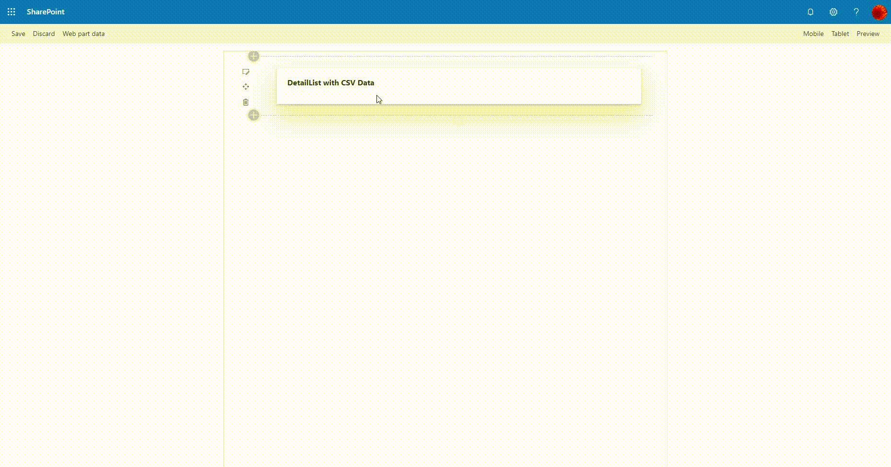

# spfx-demos

>This is a sample project with different web parts showing different capabilities.

> Please follow my blog [**_Know More_**](https://windowssharepointserver.blogspot.com/) for detailed explanation and concepts used.

## Preview

### demo1 - Using DateTime control PropertyFieldCollectionData Property Pane Control


### demo2 - Using FilePicker and FileTypeIcon control


### demo3 - Office UI Fabric react DetailsList & PropertyFieldCodeEditor to show the JSON data


### demo4 - Office UI Fabric react DetailsList & PropertyFieldCodeEditor to show the CSV data


### pivotSample - Office UI Fabric react Pivot with different variations.


### uniteGallery


## Solution

Webparts|Description
--------|---------
demo1 | Usage of [PropertyFieldCollectionData](https://sharepoint.github.io/sp-dev-fx-property-controls/controls/PropertyFieldCollectionData/) pane control with [DateTimePicker](https://sharepoint.github.io/sp-dev-fx-controls-react/controls/DateTimePicker/) control. [Click here](https://windowssharepointserver.blogspot.com/2020/02/spfx-using-datetime-control.html) for more info
demo2 | Using [FilePicker](https://sharepoint.github.io/sp-dev-fx-controls-react/controls/FilePicker/) and [FileTypeIcon](https://sharepoint.github.io/sp-dev-fx-controls-react/controls/FileTypeIcon/) to upload the file to the list item as an attachment. [Click here](https://windowssharepointserver.blogspot.com/2020/02/spfx-using-filepicker-and-filetypeicon.html) for more info
demo3 | Using [DetailsList](https://developer.microsoft.com/en-us/fabric#/controls/web/detailslist) and [PropertyFieldCodeEditor](https://sharepoint.github.io/sp-dev-fx-property-controls/controls/PropertyFieldCodeEditor/) to display the JSON data from the webpart properties in the DetailsList. [Click here](https://windowssharepointserver.blogspot.com/2020/03/spfx-office-ui-fabric-react-detailslist.html) for more info
demo4 | Using [DetailsList](https://developer.microsoft.com/en-us/fabric#/controls/web/detailslist) and [PropertyFieldCodeEditor](https://sharepoint.github.io/sp-dev-fx-property-controls/controls/PropertyFieldCodeEditor/) to display the CSV data from the webpart properties in the DetailsList. [Click here](https://windowssharepointserver.blogspot.com/2020/04/spfx-office-ui-fabric-react-detailslist.html) for more info
reactContextDemo | [Click here](https://spknowledge.com/2020/05/13/using-react-context-api-in-spfx/) for more info
pivotSample | [Click here](https://spknowledge.com/2020/06/02/spfx-using-fluent-ui-pivot-control/) for more info
uniteGallerySample | [Click here](https://spknowledge.com/2020/06/14/spfx-using-unitegallery-jquery-plugin/) for more info
React Custom Hooks | [Click here](https://spknowledge.com/2020/06/14/spfx-using-custom-hooks/) for more info

## Building the code

```bash
git clone the repo
npm i
npm i -g gulp
gulp
```

This package produces the following:

* lib/* - intermediate-stage commonjs build artifacts
* dist/* - the bundled script, along with other resources
* deploy/* - all resources which should be uploaded to a CDN.

### Build options

gulp clean - TODO
gulp test - TODO
gulp serve - TODO
gulp bundle - TODO
gulp package-solution - TODO
